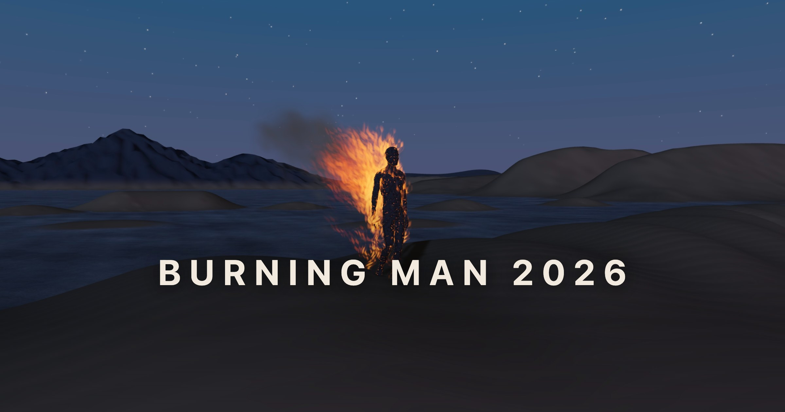

<b>An interactive audiovisual experience. Slow down a bit and let it go.</b>

A figure catches fire and walks to the sea. You can watch, or take him with
the keyboard and go your own way.

Press **Let it** to begin. **W A S D** or the arrow keys walk him relative to the
camera; let go and he finds his own way again. Drag to orbit, scroll to zoom.
**P**, **Space** or the button pauses.

It draws with WebGPU where a browser has it and falls back to WebGL2 where it
does not, and it lowers its own graphics budget on a machine that cannot hold
the frame rate.

## Build

Building needs a licensed copy of the
[Three.JS Water Pro](https://threejsroadmap.com/assets/threejs-water-pro)
library beside this checkout — see [THIRD-PARTY.md](THIRD-PARTY.md).

## License

[PolyForm Noncommercial 1.0.0](LICENSE) — yours to watch, play with and learn
from; selling it or running it for other people is a conversation. What it is
built on is listed in [THIRD-PARTY.md](THIRD-PARTY.md).

<a href="https://github.com/excelsior-arts">Excelsior Arts</a>

